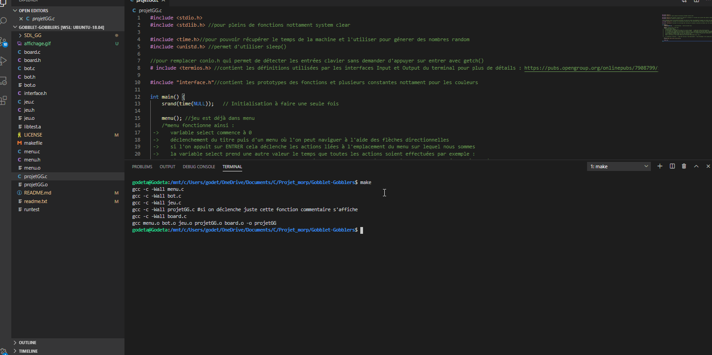

# Gobblet-Gobblers
A project in C on linux in command line (you can also use the ubuntu extension for windows which is fast to implement). It's a simple game with an AI and menu.

### Usage

```
    # compile the program
    $ make

    #you can also run some test using "make test" to check if the program works

    # erase the unused compiled files
    $ make clean
    
    # start the program
    $ ./ProjetGG
```

